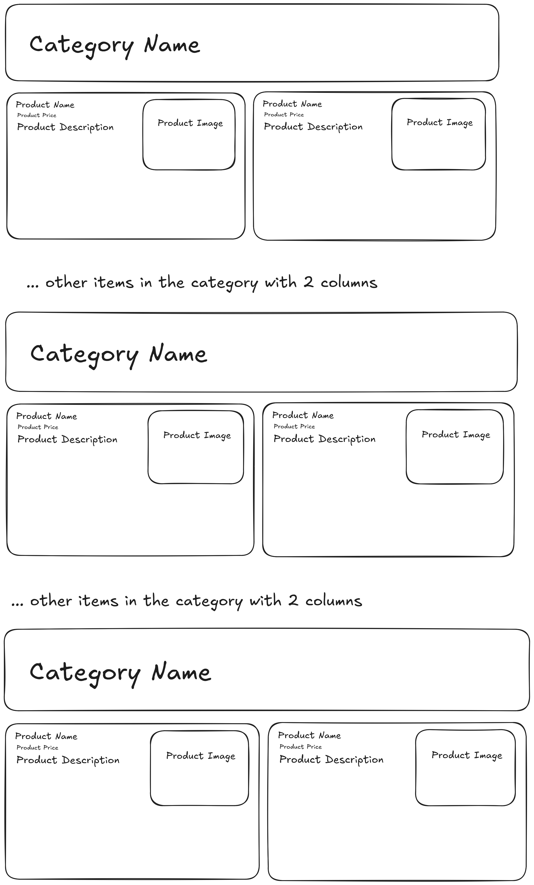

# Opaper Frontend Take-Home Test

# requirements

display the item list by category following the design

the styling is up to you (coloring and sizing etc..), but please make sure the design is aligned
with the mockup and
also looks good on mobile devices and
aesthetically easy to read and understand (bonus point).

# how to start the project

- clone this repo
- run `pnpm install`
- run `pnpm dev`
- open `http://localhost:5173/` in your browser
- the api for items is on `http://localhost:5173/api/items`
- start hacking and coding

If you have any questions, please feel free to contact us at tanjung.kusuma@opaper.app
